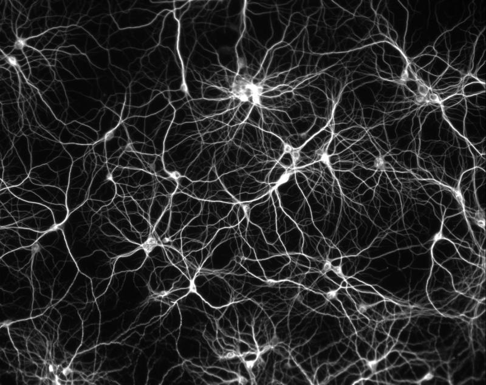
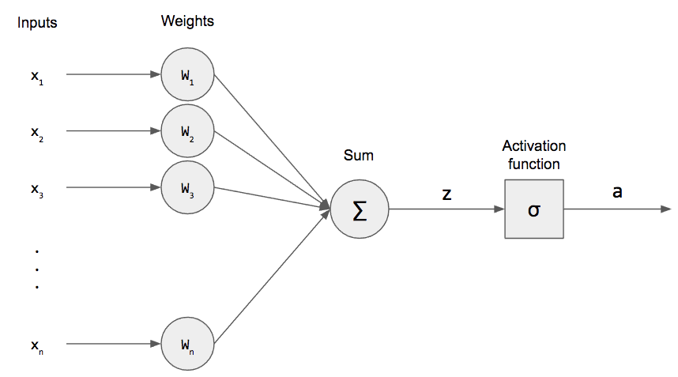
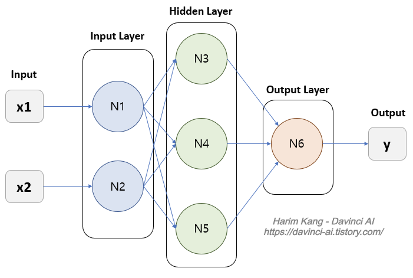
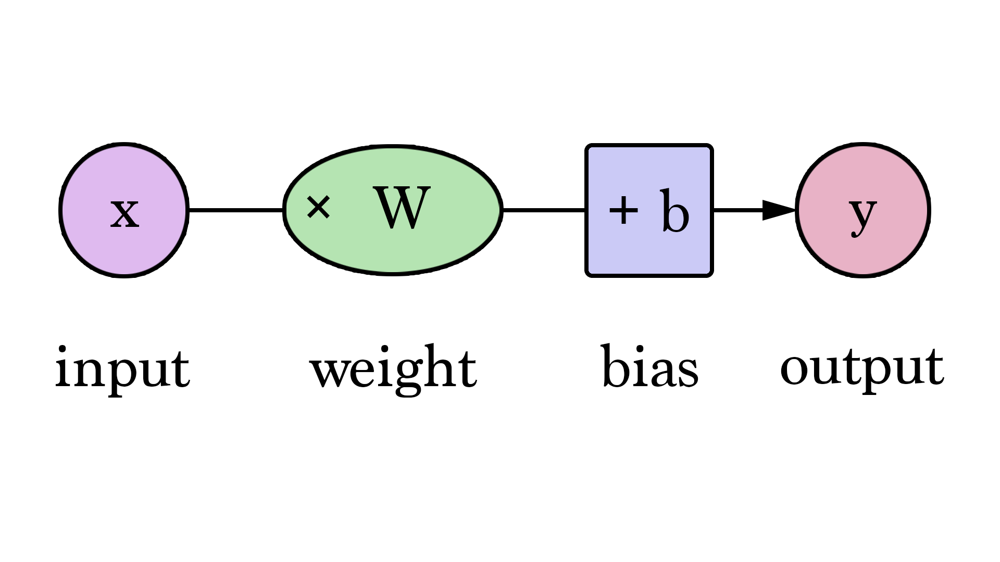
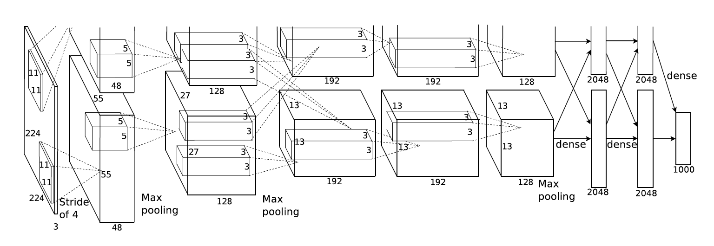
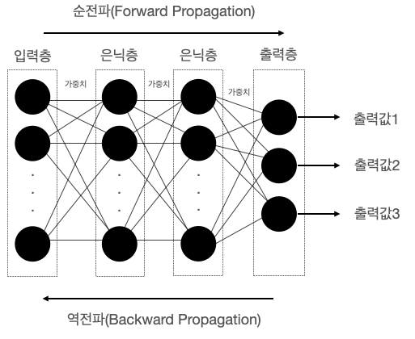

**안녕하세요. 오늘은 딥 러닝의 기초적인 이론들을 정리해보려고 합니다. 저는 뉴럴 네트워크 중에서도 CNN을 위주로 공부했기 때문에 아마 다른 부분을 다룬 포스팅을 원하신다면 다른 블로그를.... 찾아보셔야 할거에요... 😂 그럼 시작해보겠습니다!**


### 0. 들어가기 전..

  - 오늘 알아볼 것은 인공지능(A.I)에서도 머신러닝의 한 종류라고 할 수 있는 **딥러닝**입니다. 먼저 머신러닝(Machine Learning)은 해석해보면 ‘기계 학습’입니다. 처음 접하면 잘 이해가 안될 수 있지만 사실은 꽤나 직관적으로 표현된 이름입니다. 
  - 기계를 학습시킨다.. 라는 뜻을 이해하려면 먼저 **학습**을 알아야 합니다. 여기서 쓰이는 학습이라는 의미는 기계(모델)가 스스로 데이터의 규칙(Solution)을 찾도록 하는 것입니다. 이 기술과 반대되는 기술은 전통적인 방법으로 ‘Traditional’, ‘Hand-crafted’라고 표현합니다. 다른 말로 사람이 직접 데이터의 규칙을 정하고 컴퓨터는 그저 연산만 진행하는 방법입니다. 하지만 머신러닝은 컴퓨터가 학습을 반복하면서 규칙을 찾고 최적의 해를 구한다는 점에서 굉장히 차이가 있다고 할 수 있습니다. 여기서 왜 ‘머신’ + ‘러닝’(기계 + 학습)이 직관적이라고 표현 했는지 이해가 될 것이라고 생각합니다. 
  - 자, 그렇다면 이 머신러닝은 어떻게 구현이 될까 의문이 듭니다. 바로 여러가지 종류의 알고리즘 중에서 선택하면 되는데 그 중에서 인공신경망(Artificial Neural Network)을 쓰는 기술을 딥러닝이라고 합니다. 주로 머신러닝은 정형데이터, 딥러닝은 비정형데이터를 잘 처리한다고 하니 그 점 또한 참고해두면 좋을 것 같습니다. 이제 더 자세한 기초 이론을 뜯어보겠습니다!


### 1. 뉴런



- 모두들 알듯이 뇌에 존재하는 신경세포입니다. 생물학적으로 뉴런은 시냅스라는 뉴런 사이의 길을 통해서 전기신호를 이용해서 신호를 보냅니다. 이는 **BNN**, 즉 **Biological Neural Network**라고 합니다.


### 2. Perceptron



- 1957년 고안된 인공신경망입니다. 다수의 입력과 하나의 출력으로 나타내어지며 구성은 입력, 가중치, 활성함수, 그리고 출력으로 이루어져있습니다. 생물학적인 뉴런의 개념을 따서 만든 컴퓨팅 모델이라고 이해하시면 됩니다.
- 이는 아래 그림과 같이 세가지 계층이 있는데 입력 계층, 은닉 계층, 그리고 출력 계층입니다.



- 세개의 계층(Layer)중에서 왼쪽 계층인 입력 계층은 입력 데이터를 받는 계층이고 오른쪽 계층은 출력 계층으로 출력 결과물을 만들어내는 역할을 합니다. 여기서 중요한 부분은 입출력 계층 사이에 있는 **은닉 계층(Hidden Layer)** 입니다.
- 위 그림에서 각 노드끼리 연결되어 있는 선들은 노드 사이에서 일어나는 연산을 의미합니다. 이때 연결 강도는 **Weight(가중치)** 라는 용어로 부르고 **Bias(편향)** 이라는 상수 또한 존재합니다.
- 은닉 계층이 2개 이상인 네트워크를 **Deep Neural Network**라고 합니다.


### 3. Weight(가중치), Bias(편향)



- **Weight(가중치)** : Learnable Parameter로써 위에서 설명한 뉴런(노드) 사이의 연결 강도를 의미하며 이전 레이어에서 넘어온 입력이 다음 레이어에서 얼마나 중요한 역할을 하는지 결정해주는 변수라고 생각하시면 이해가 쉬울 것 같습니다. 중요도(가중치)를 의미하므로 입력 값에 곱해주게 됩니다. 훈련을 거듭하면서 더욱 정확한 결과물을 도출하기 위한 값으로 업데이트 됩니다.
- **Bias(편향)** : 입력에 가중치를 곱해준 값에 더해주는 값으로 수식에서 상수와 같은 역할을 합니다. 이로써 $y = Wx + b$ 라는 수식이 완성됩니다. Bias 또한 훈련을 거듭하며 업데이트가 되며 활성화 함수를 거친 값에 최종적으로 출력 값을 조절해주는 역할을 합니다.


### 4. 인공지능 부흥(CNN)



- 위 그림은 2012년 개최된 ILSVRC 대회에서 우승을 차지만 CNN 구조인 AlexNet입니다. CNN 구조의 부흥에 아주 큰 역할을 했다고 할 수 있습니다.
- 먼저 인공지능 중에서도 CNN 구조의 딥 러닝에 대한 이론은 전부터 많이 나왔지만 제대로 쓰이지 못했던 가장 큰 이유는 앞서 소개한 Hand-crafted 모델에 비해 성능이 떨어졌기 때문입니다. 자, 그러면 왜 주목받지 못할 정도로 한참 성능이 떨어졌을까요?

   1. **하드웨어의 한계** : 엄청난 양의 파라미터들을 Handling하기에 병렬처리가 불가능했던 옛날 하드웨어의 성능이 따라가지 못했습니다.(현재는 엄청난 성능의 GPU로 모델의 학습 속도 향상 및 Real-time 연산 수행이 가능해짐)

   2. **알고리즘의 한계** : 많이 연구되지 않은 분야였기에 알고리즘 적으로도 문제가 많았습니다.(최근 많은 주목을 받은 만큼 다양한 분야의 인재들이 대거 투입되어 활발한 연구 진행중. 매년 수 많은 연구가 진행되며 다양한 논문이 발표됨)

   3. **데이터의 한계** : 모델 학습을 위해 수 많은 데이터들이 필요한데, 이 데이터들을 모두 수집하기에는 큰 어려움이 있었습니다.(현재는 인터넷의 발달로 많은 연구원들이 수집한 데이터셋들을 인터넷에서 쉽게 찾을 수 있음)

- 이렇게 많은 한계를 극복하고 2012년 AlexNet을 필두로 획기적인 전환점을 맞이합니다.


### 5. 신경망의 학습



- 데이터를 입력하고 연산을 거쳐 결과를 도출해내는 과정을 **순전파(Forward Propagation)** 이라고 합니다. 이때 모델이 **예측한 값(Estimation)** 과 해당 데이터의 **정답(Ground Truth)** 의 차이를 **손실 함수(Loss Function)** 를 사용하여 **에러**, **손실(Loss)** 을 계산합니다. 이 손실 값을 이용해서 현재 예측에 사용된 Weight , Bias 등 파라미터들이 얼마나 잘못되었는지 체크하고 거꾸로 돌아가서 손실을 더 낮추는 방향으로 업데이트하는 것이 역전파입니다.
- **역전파(Backward Propagation)** 은 역방향으로 출력에서 입력 방향으로  손실의 **미분 값(Gradient)** 이 줄어드는 방향으로 업데이트 합니다. 해당 방법을 **경사하강법(Gradient Descent)** 라고 합니다. **연쇄법칙(Chain rule)** 을 사용해서 편미분을 보다 쉽게 계산하는 것을 수학적으로 좀 더 자세히 설명하고 싶은데 일단 기초 이론이므로 다음에 기회가 된다면 새로운 포스팅을 작성해보겠습니다.
- **학습률(Learning Rate)** 라는 것도 존재하는데 이는 학습된 값을 얼만큼 적용하냐를 결정해주는 하이퍼파라미터입니다. 해당 변수가 너무 크다면 **과적합(Overfitting)** 문제가 발생해서 발산해버리는 문제가 발생할 수 있습니다. 반면 너무 작다면 학습이 지나치게 오래 걸리는 문제가 발생할 수 있으므로 적당한 값을 찾아서 설정해주어야 합니다.


### 6. 마무리

이상으로 딥 러닝 기초 이론 포스팅을 마치겠습니다. 항상 말씀드리지만 틀린 부분도 있고 빼먹은 부분도 많을 거라고 생각합니다😭 자주 체크하며 틀린 부분은 고쳐나가겠습니다. 감사합니다!


```toc
```