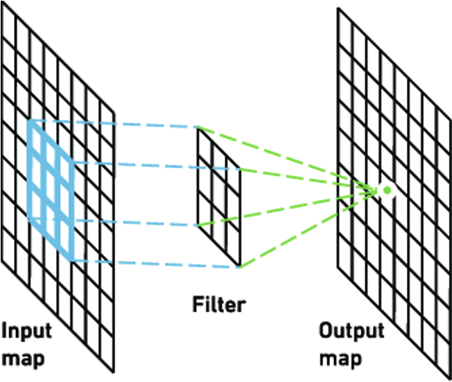
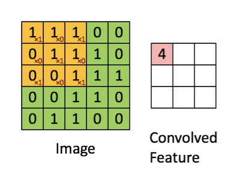
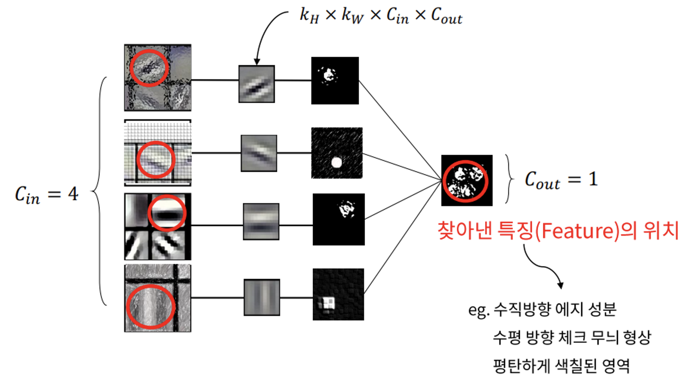
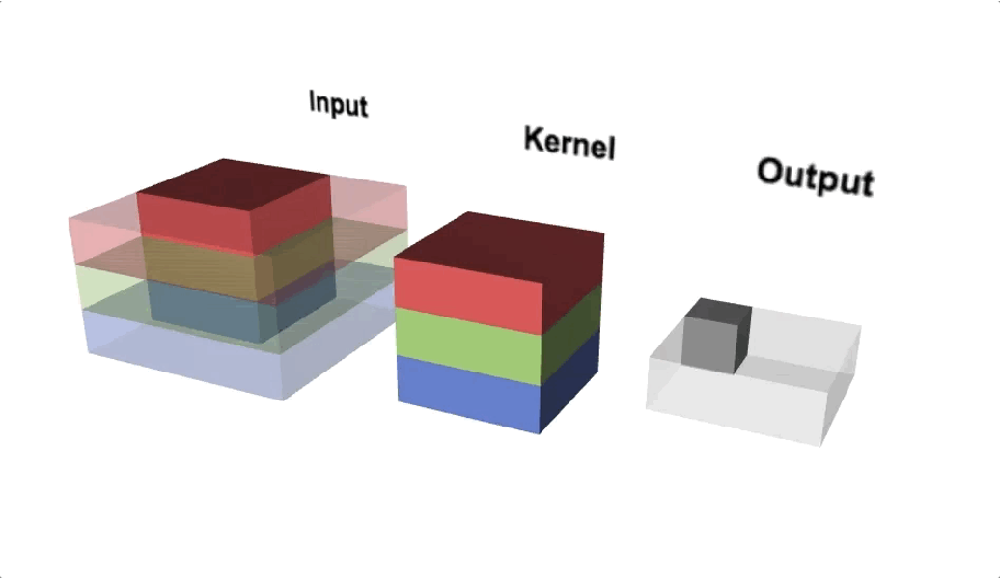
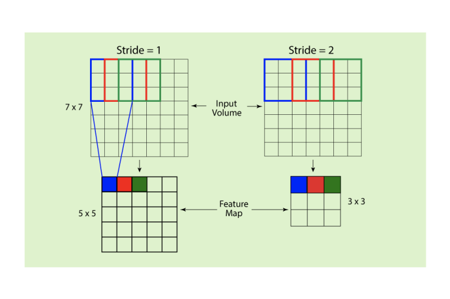
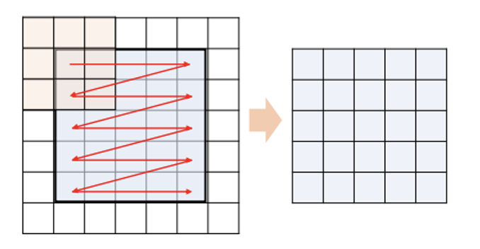
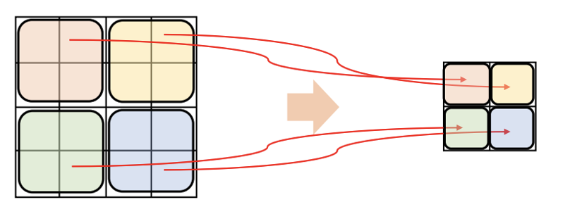
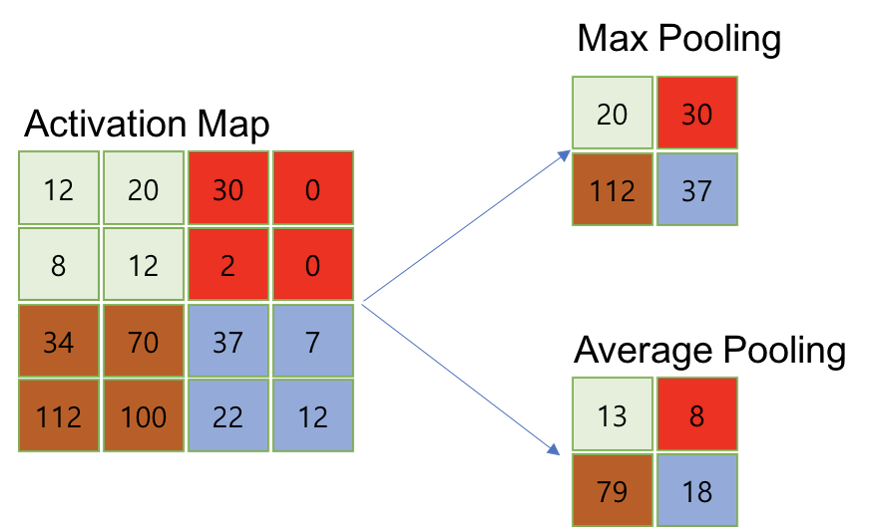
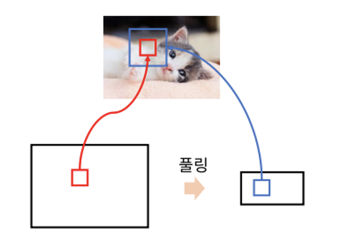
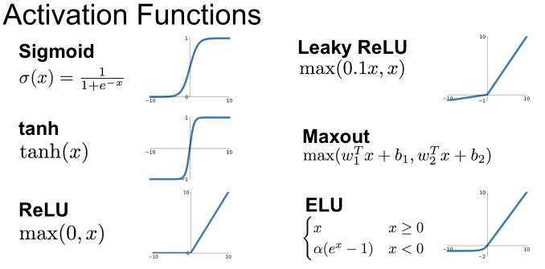

**안녕하세요. 오늘은 딥 러닝의 기초적인 용어들을 정리해보겠습니다. 기초 용어라고 해도 제가 배운 내용을 토대로 정리하는 거라 빠진 부분이나 틀린 부분이 많을 수 있습니다! 또한 주로 컴퓨터 비전 분야에서 많이 쓰이는 용어들을 주로 정리 했습니다!**

### 1. Data

- 모델을 학습시키는 데이터. 일반적으로 모델에 들어가기 전 전처리를 필요로 한다.


### 2. Model

- 다양한 Layer 층으로 구성된 네트워크이다. 학습을 할 수 있는 파라미터들이 들어있다.


### 3. Convolution Layer





- **합성 곱 계층**이라고 불리며 입력 값에 대해서 Filter를 합성 곱을 진행해서 Feature Map을 뽑아주는 계층이다. 뒤에서 나오겠지만 padding이라는 과정을 거치지 않으면 입력에 비해 출력 map은 크기가 줄어든다. 이렇게 나온 출력 Feature Map은 특징 맵이라고 불리며 입력 이미지에서 각 필터에 해당하는 특징을 뽑아낸 것이라고 생각하면 된다. (이 부분이 처음에는 직관적으로 이해하기 어려웠는데 아래 그림을 보고 조금은 도움이 되었다.)

> (+) 아래 그림에서 좌측의 동그라미가 각 입력 이미지들이고 작은 이미지가 필터이다. 그렇게 특징을 뽑아내면 세번째 그림같이 특정 response가 나타난다. 이런 식으로 특징을 뽑는다고 이해하면 조금은 편해질 것 같다.




### 4. Parameter / Hyper Parameter

- **Parameter**는 매개변수라는 뜻으로 모델 내부에서 데이터로부터 결정되는 변수입니다.

- **Hyper Parameter**는 모델링할 때 사람이 직접 정해주어야하는 변수입니다.


### 5. Channel / Kernel



- **채널**은 각 계층의 이미지에서 특징의 개수라고 생각하면 편합니다. 일반적으로 입력 이미지는 RGB 3개의 채널을 가졌고 convolution을 거듭할 수록 늘어납니다. 각 계층의 커널의 개수가 채널의 개수와 동일한데, 그 계층의 출력 feature map의 개수 또한 동일하므로 특징의 개수라고 이해할 수 있습니다.

- **커널**은 앞선 설명에서는 filter라고 불렀던 것과 같습니다. 사실 filter보다 많이 쓰이는 용어가 커널이지만 앞에선 설명을 위해 filter라는 용어를 썼고 이제부터는 kernel이라고 부르겠습니다. 일반적으로 정사각 행렬로 이루어졌고 특징을 찾아내기 위한 파라미터이고 학습을 거듭할 수록 더욱 좋은 특징을 찾아내도록 학습됩니다.


### 6. Stride / Padding





- **Stride**는 보폭이라는 뜻으로, kernel이 몇 칸씩 뛰어 넘으며 합성 곱을 수행하는지 결정하는 하이퍼 파라미터입니다.

- **Padding**은 합성 곱을 진행할 때 입력 이미지의 가장자리는 kernel이 한번 밖에 거치지 않기 때문에 영향력이 무시될 수 있습니다. 이를 방지하기 위해 진행하는 padding은 가장자리에 상하좌우에 특정 값으로 채운 몇 줄을 추가해서 입력 이미지의 크기를 키워주는 것입니다. 주로 **zero padding**을 쓰며 이는 0으로 채워줍니다.


### 7. Pooling





- **Pooling**은 여러 pixel의 값을 하나의 pixel로 줄여주는 것으로 영상의 크기를 줄이고 정보를 종합하고 싶을 때 사용합니다. Max pooling, Average pooling 등 여러 종류가 있으며 max pooling은 해당 pixel중 가장 큰 값을, average pooling은 평균을 채택합니다.


### 8. Receptive Field



- **Receptive Field**는 kernel로 입력 영상에 대해 연산을 수행할 때 해당 연산의 결과에서 한 pixel이 얼만큼의 pixel 정보들을 내포하는 지를 나타냅니다. 예를 들어보자면 5x5 kernel을 한번 적용한 결과 map의 한 pixel은 입력 영상의 5x5 영역의 정보를 포함합니다. 그렇다면 3x3 kernel을 두번 연속으로 적용한다면 결과는 어떻게 될까요? 이 두가지 예의 receptive field는 서로 같습니다. 3x3을 수행하고 한번 더 3x3을 수행한다면 3x3의 receptive field를 가지고 있는 첫 번째 feature map에서 3x3을 한번 더 진행한 것이므로 5x5의 같은 receptive field를 가집니다.

> 큰 receptive field는 local information과 contextual information이 중요한 컴퓨터 비전 분야에서는 정확도 면에서 좋은 결과를 뽑아내는 데 도움이 됩니다.


### 9. Activation Function



- 활성 함수라는 뜻으로 입력 값을 신호로 본다면 이 신호가 활성화되는지 확인하는, 즉 필요한 값을 솎아내는 역할을 합니다. 활성 함수에는 굉장히 많은 종류가 있습니다. 대표적으로 Sigmoid, ReLU 등이 있고 이 활성 함수는 모델의 비선형성을 증가 시켜주는 역할도 있습니다.


### 10. 마무리

여기까지 기초 용어들을 정리해봤습니다. 사실 아직 정리하지 못한 용어가 산더미입니다.😢 Batch, back propagation 등등 아주 많아요.. 나머지 용어들은 기초 용어 정리 2에서 더 정리해보겠습니다.

읽어주셔서 감사합니다!

```toc

```
