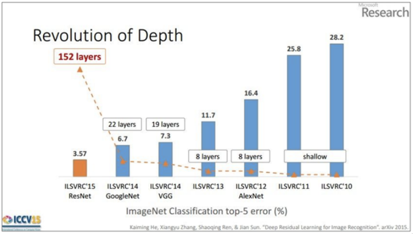
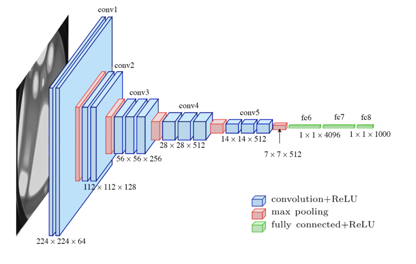
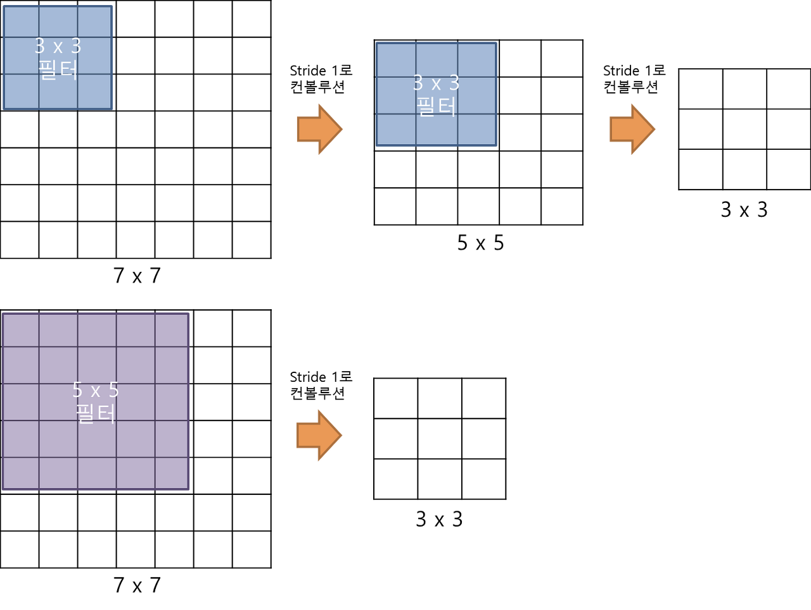
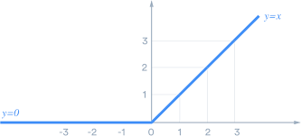
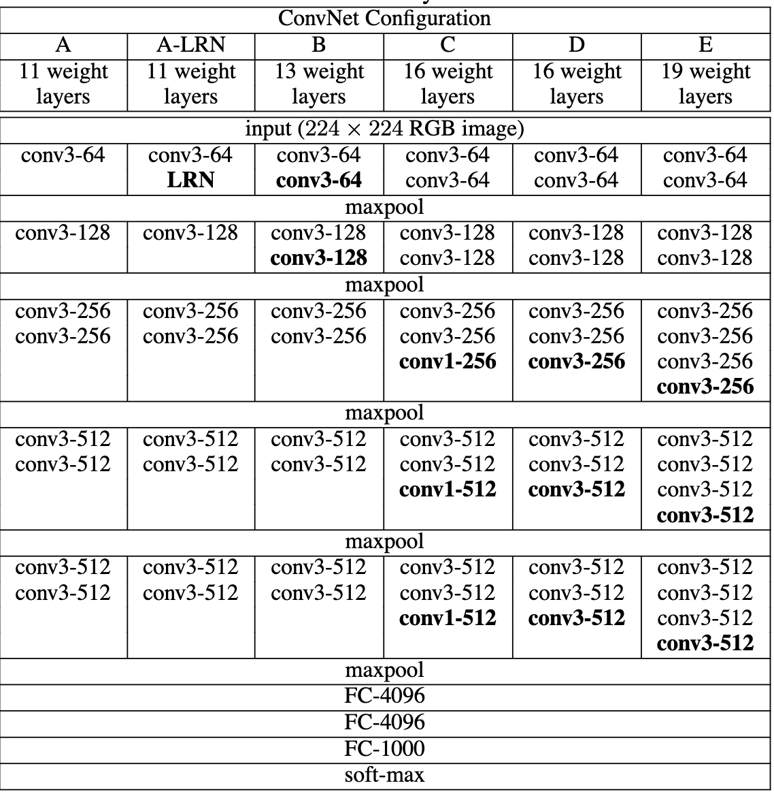
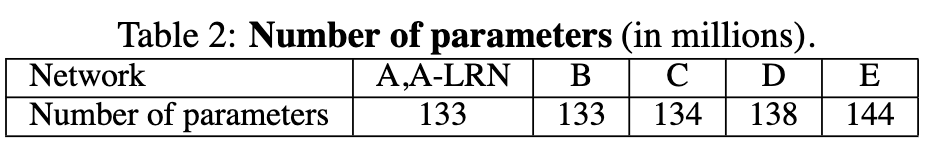
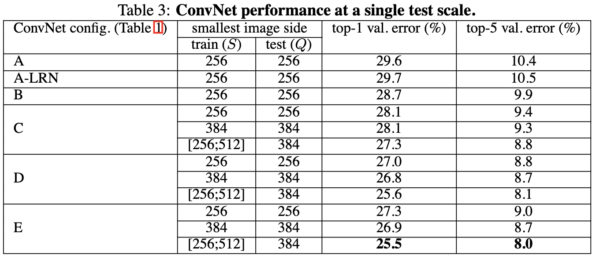
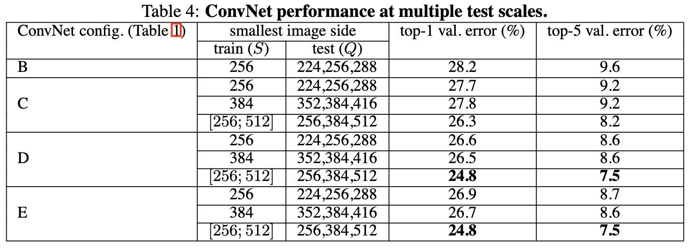

**안녕하세요. 오늘은 드디어 첫번째 논문 리뷰 포스팅입니다! 오늘 리뷰할 논문은 바로 2014년 옥스포드 대학의 연구팀 VGG에 의해 발표된 “Very Deep Convolutional Networks for Large-Scale Image Recognition” 입니다!**

[https://arxiv.org/abs/1409.1556](https://arxiv.org/abs/1409.1556)

**당시 이미지넷 인식 대회에서 준우승을 한 획기적인 네트워크였습니다. VGGNet은 VGG-16과 VGG-19로 나뉘는데 이 숫자는 Layer의 개수를 의미합니다. 한 마디로 16계층과 19계층짜리 네트워크를 만든거라고 보면 됩니다. 이 논문이 중요하다고 생각하는 이유는 해당 논문의 발표 이후로 네트워크의 깊이가 얼마나 중요한지, 또한 어떻게 깊게 만드는지에 대한 인식을 하기 시작했다고 생각하기 때문입니다.** 

**자, 이제 리뷰를 시작해보겠습니다.**

  

  

  

  

### 0. 들어가기 전..

  



- 위 그림은 네트워크 깊이와 ImageNet 에러율에 대한 그래프입니다.
- VGG 이전에 발표된 AlexNet과 같은 네트워크들을 8개의 계층밖에 가지지 못하면서 에러율도 높다는 것을 확인할 수 있는데요, 반면에 VGG부터 Layer의 수가 늘어나면서 에러율 또한 현저히 낮아진 것을 알 수 있습니다.
- 이 다음에 리뷰할 예정인 ResNet부터 Layer의 수가 폭발적으로 증가한 것 또한 확인할 수 있습니다.

  

### 1. 네트워크의 깊이(Depth)

  

- 그러면 왜 그동안 네트워크의 깊이를 마냥 늘려가지 못했을까요? 이 의문에 대한 답은 **Gradient Vanishing, Overfitting, Increasing train time** 등의 이유가 있습니다.
- **Gradient Vanishing**은  활성화 함수(Activation function)을 이용해서 기울기 기반 학습(Gradient based training)을 진행할 때 발생하는 문제입니다. 간단하게 설명하자면 역전파를 이용해서 학습시킬 때 파라미터 값의 변화량인 Gradient가 너무 적게 변화한다면 training이 정상적으로 수행되지 않은 상태에서 수렴해버리는 문제가 발생하고 이를 Gradient가 사라진다고 해서 Gradient Vanishing이라고 합니다.
- **Overfitting**은 과적합이라는 뜻인데, 훈련 데이터 셋으로 과하게 학습되어 모델의 파라미터들이 학습 데이터 셋에 너무 들어맞는(?) 상태가 되어 새로운 데이터 셋인 테스트 데이터가 들어오면 제대로 동작하지 못하는 문제입니다. 주로 모델이 너무 복잡할 때 발생합니다.
- **Increasing train time**은 간단하게 학습 시간이 너무 오래 걸린다는 뜻입니다.
- 이러한 문제점들이 항상 있었고 해당 논문의 저자는 이 한계들만 뛰어넘는다면 더욱 정확한 모델을 만들 수 있겠다는 생각이 들었다고 합니다.

  

### 2. VGGNet의 구조

  



- 해당 그림은 VGG-16의 구조입니다.
- VGG팀은 깊이가 주는 영향력을 알기 위해 kernel은 3x3, stride는 1로 고정해서 깊지만 더욱 간단한 모델을 설계했습니다.
- 해당 kernel로 convolution을 진행한 후에는 2x2 Max pooling을 2의 stride로 진행합니다.
- 그렇다면 왜 3x3 convolution을 사용했을까요? 그 이유는 Receptive Field와 Parameter 수에 있습니다.

### 3. Why 3x3 Convolution?



  

- 그림을 보면 쉽게 설명이 될 것 같습니다. 위 그림과 같이 7x7 입력 이미지에 3x3 convolution을 두번 진행하면 Receptive field는 5x5가 됩니다. 또한 아래 그림과 같이 5x5 convolution을 한번 진행하면 똑같이 5x5의 Receptive field를 가지게 됩니다. 하지만 이때 필요한 parameter 수가 바뀌는데요, 3x3을 두번 진행하면 9 + 9로 18개의 parameter가 필요하고 5x5는 25개의 parameter가 필요하게 됩니다. 즉, 같은 receptive field를 갖지만 적은 parameter가 쓰이는 네트워크를 만들 수 있다는 뜻입니다.
- 고로 3x3 convolution만을 사용해서 네트워크를 설계하면 엄청나게 적어진 parameter 수로 앞서 설명한 문제점들이 줄어들었다는게 저자의 설명입니다.

  

### 4. Activation Function



- 3x3 Convolution을 사용하는 또 하나의 장점은 convolution layer가 늘어남으로써 Activation Function을 더욱 여러번 수행할 수 있었습니다.
- 네트워크를 깊게 만드는 데에서 **비선형성(Non-linearity)** 는 중요한 요소이기에 non-linear activation function인 **ReLU**를 사용해서 비선형성을 늘려줬다고 합니다.
- 이렇게 비선형성을 늘려주면 모델은 더욱 유용한 특성을 뽑게 되고 학습의 효과가 증폭된다고 합니다.

  

### 5. Result



- 위 그림이 해당 논문에서 저자가 실험을 진행한 모델들입니다. A~E까지 6개의 모델로 나눠서 진행했는데 여기서 D와 E가 현재 우리가 아는 VGG-16과 19입니다.



- 위 표는 해당 모델들에서 사용된 Parameter의 수입니다. Layer의 수는 증가되었지만 parameter는 크게 증가되지 않은 점을 확인할 수 있습니다.



- 하나의 Image scale만으로 테스트를 진행한 결과입니다.
- Error rate면에서 D와 E 모델이 나머지 모델들보다 우수한 것을 확인할 수 있습니다.



- 다음은 여러 scale에서 진행한 테스트 결과입니다.
- 마찬가지로 D와 E 모델이 나머지 모델들보다 훨씬 우수하다는 것을 확인할 수 있습니다.

### 6. 마무리

  

해당 VGG 논문은 섣불리 늘리지 못했던 네트워크의 깊이를 늘린 것과 그에 따른 정확도의 향상의 상관관계를 널리 알린 연구로 큰 의미가 있다고 생각합니다. 이 다음엔 ResNet에 대한 논문을 리뷰해볼 예정인데 폭발적으로 증가한 Layer의 개수는 또 어떤 방법을 사용해서 늘린건지 한번 정리를 해보도록 하겠습니다 😄

읽어주셔서 감사합니다!


```toc
```